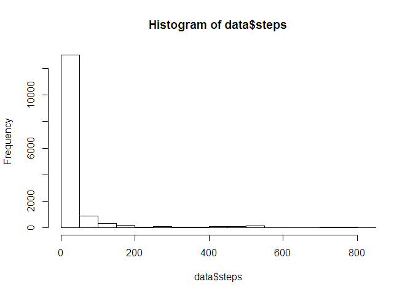
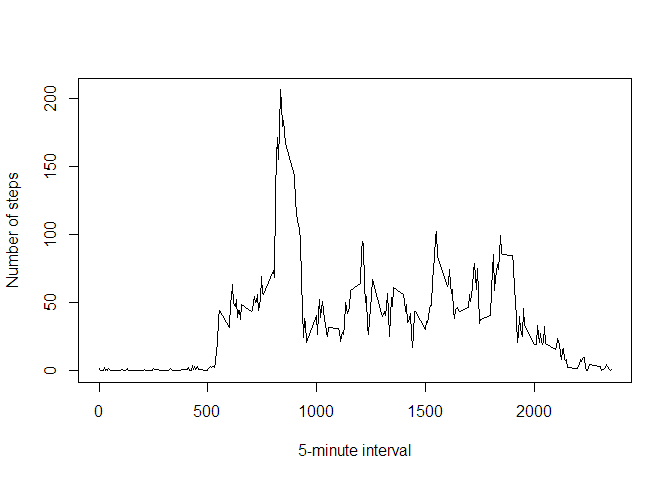
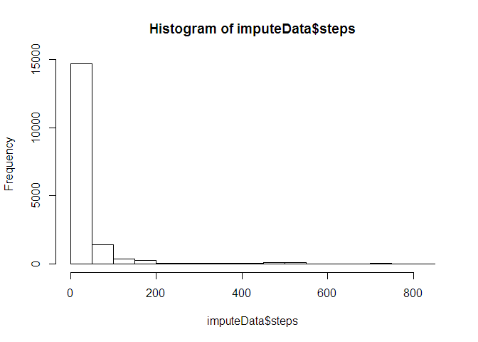
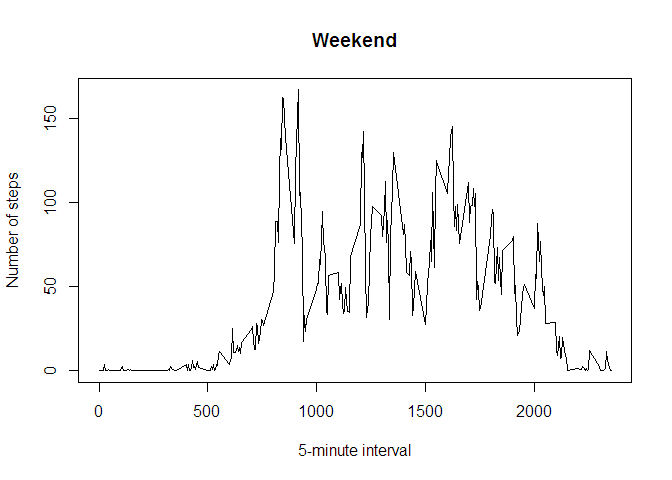
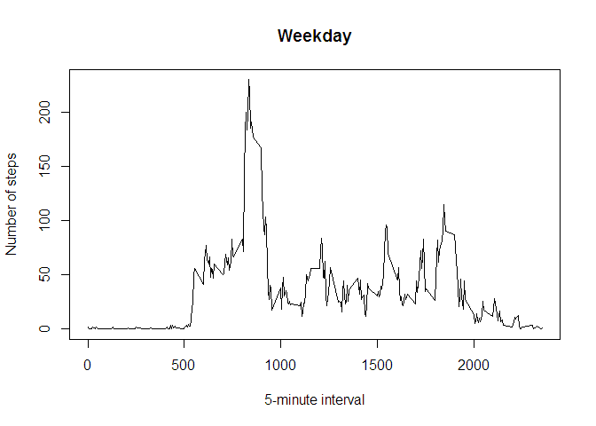

# Reproducible Research: Peer Assessment 1


#### Loading and preprocessing the data


```r
data <- read.csv("activity/activity.csv", colClasses=c(NA,"Date",NA))
```


#### What is mean total number of steps taken per day?

Mean number of steps per day: 37.3825996

Median number of steps per day: 0

Histogram of steps:


```r
hist(data$steps)
```

 


#### What is the average daily activity pattern?

Plot of average number of steps per interval:


```r
library(plyr)
intervalMeans <- ddply(data, .(interval), numcolwise(mean, na.rm=TRUE))
plot(intervalMeans$interval, intervalMeans$steps, type="l", xlab="5-minute interval", ylab="Number of steps")
```

 


```r
maxInterval <- intervalMeans[which.max(intervalMeans$steps),]
```

The interval with the highest average number of steps is 835 with 206.1698113 steps.


#### Imputing missing values


```r
completeRows <- complete.cases(data)
```
Total number of rows with NAs: 2304

We will fill missing values with averages from the intervals.


```r
imputeData <- transform(data, steps = ifelse(is.na(steps), ave(steps, interval, FUN = function(x) mean(x, na.rm = TRUE)), steps))
```

Histogram of imputed steps:


```r
hist(imputeData$steps)
```

 

Mean number of steps per day (with imputed): 37.3825996

Median number of steps per day (with imputed: 0

These are the same as pre-imputed values.

#### Are there differences in activity patterns between weekdays and weekends?

Add weekend and weekday columns:


```r
days <- weekdays(imputeData$date)
imputeData$weekend <- days %in% c("Saturday", "Sunday")
head(imputeData)
```

```
##       steps       date interval weekend
## 1 1.7169811 2012-10-01        0   FALSE
## 2 0.3396226 2012-10-01        5   FALSE
## 3 0.1320755 2012-10-01       10   FALSE
## 4 0.1509434 2012-10-01       15   FALSE
## 5 0.0754717 2012-10-01       20   FALSE
## 6 2.0943396 2012-10-01       25   FALSE
```

Plot weekend and weekday average steps:


```r
weekendSubset <- subset(imputeData, weekend==TRUE)
weekdaySubset <- subset(imputeData, weekend==FALSE)

weekendMeans <- ddply(weekendSubset, .(interval), numcolwise(mean, na.rm=TRUE))
weekdayMeans <- ddply(weekdaySubset, .(interval), numcolwise(mean, na.rm=TRUE))

plot(weekendMeans$interval, weekendMeans$steps, type="l", xlab="5-minute interval", ylab="Number of steps", main="Weekend")
```

 

```r
plot(weekdayMeans$interval, weekdayMeans$steps, type="l", xlab="5-minute interval", ylab="Number of steps", main="Weekday")
```

 
